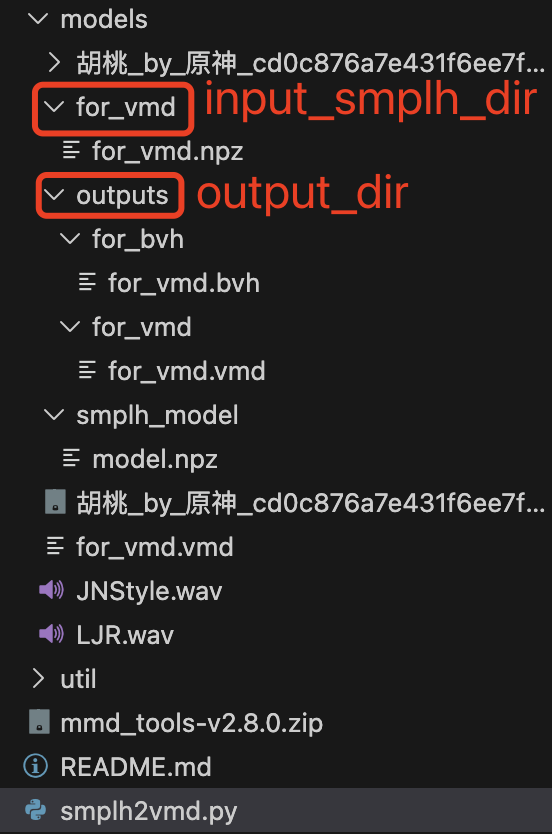

# Env Setup

- conda env installation
    ```
    conda create -n smplh2vmd python=3.11
    conda activate smplh2vmd
    pip install bpy==4.2.0
    pip install scipy
    pip install toml
    pip install pyyaml
    pip install easydict
    ```

- mmd_tools
Download the [mmd_tools](https://github.com/UuuNyaa/blender_mmd_tools/releases/tag/v2.8.0) and unzip it, then install it as a bpy addon.
    ```
    wget https://github.com/MMD-Blender/blender_mmd_tools/releases/download/v2.8.0/mmd_tools-v2.8.0.zip

    unzip mmd_tools-v2.8.0.zip

    cd conda_env_dirs/smplh2vmd/lib/python3.11/site-packages/bpy/4.2/scripts
    mkdir addons
    cp -r mmd_tools conda_env_dirs/smplh2vmd/lib/python3.11/site-packages/bpy/4.2/scripts/addons
    ```
- SMPLH model prepare

    Download the [SMPLH](https://mano.is.tue.mpg.de/download.php) model (`Extended SMPL+H model`) and extract the files.

## Run
The smplh parameter file is generate by a music2dance algo., i.e. [LODGE](https://github.com/li-ronghui/LODGE). Note that there is no finger, all the fingers joints are set to 0.
```
python smplh2vmd.py --input_smplh_dir /path/to/smplh_model --output_dir /path/to/output_dir
```
example output:


## Acknowledgement
- [MMD_Tools](https://github.com/UuuNyaa/blender_mmd_tools)
- [CharacterAnimationTools](https://github.com/KosukeFukazawa/CharacterAnimationTools)
- [LODGE](https://github.com/li-ronghui/LODGE)
